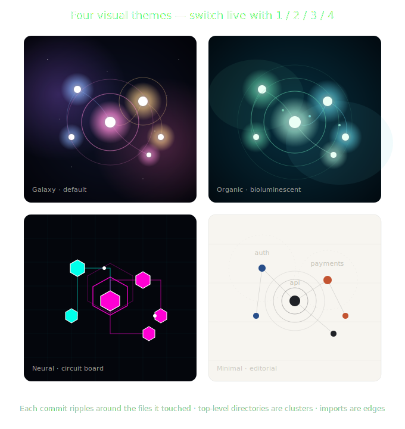

# Repo Visualizer

> A cinematic timeline of your codebase. Watch a repository grow from its first
> commit to its latest state — every feature blooming into existence, every
> import knitting the architecture together, every commit a pulse of light
> rippling through the system.

**Live demo** [repovisualizer.netlify.app](https://repovisualizer.netlify.app/) ships the bundled demo dataset only.

[](https://app.netlify.com/projects/repovisualizer/deploys)


Repo Visualizer reads a git repository's full history, extracts the import
graph between files at every commit, and renders the evolving structure as
an animated force-directed network. Each top-level directory is a feature
cluster; each file is a node sized by code churn; each import is an edge.
A commit advances the timeline and triggers a ripple from every touched file.

**Features**

- **Growth over time** — nodes appear and disappear as you move through history; the timeline scrubs quickly with a virtualized scrubber
- **Final state** — jump to the end of history in one action (toolbar button or `End` key); large repos show a progress bar while the graph catches up
- **Canvas navigation** — scroll or pinch to zoom, drag to pan; on phones and tablets use **one finger to pan** and **pinch to zoom** on the graph. **Auto fit** (on by default) keeps the growing graph in view while playback runs
- **File inspector** — click a node to see import dependencies (`Depends on` / `Imported in`) and recent commits that touched it
- **Legend focus** — click a cluster in the legend to highlight that folder and dim everything else; click again or press `Esc` to clear
- **Render quality** — **Auto-Res** switches to fast GPU rendering only when the graph is very large; **Hi-Res** / **Low-Res** force canvas or WebGL
- **Large repos** — WebGL point renderer for Galaxy at high node counts, with automatic canvas fallback if WebGL is unavailable
- **Mobile layout** — speed, themes, zoom, and other options live in the expandable **Controls** panel; **Info** opens the commit card and cluster legend

Four visual themes are included, all switchable live:

- **Galaxy** — Deep space, glowing stars, supernova ripples. The default.
- **Organic** — Bioluminescent cells breathing in soft cyan, light particles
  flowing along filaments, sonar shockwaves on commit.
- **Neural** — Sharp neon geometry on a circuit-board grid, octagonal nodes,
  hexagonal shockwaves, data pulses traveling along Manhattan-routed wires.
- **Minimal** — Cream paper, restrained ink, hairline strokes, fine typography.
  Reads like a New York Times Upshot piece.

The timeline plays automatically, or you can scrub through history,
adjust playback speed, and **export the whole animation as a WebM video**
or **GIF** for sharing.



---

## Quick start

```bash
npm install
npm run dev
```

That's it. The app boots with a built-in **demo dataset** (a synthetic SaaS
codebase across ~45 commits) so you can explore all four visual themes
without configuring anything.

Visit <http://localhost:5173> and press **play**.

---

## Visualize your own repo

To replace the demo dataset with a real one, point the analyzer at any local
git repository:

```bash
npm run analyze -- /path/to/your/repo
```

This walks the entire commit history, parses imports for every changed file
in every commit, and writes the result to `public/data/history.json`. The
web app picks it up automatically — refresh the browser and you'll see
your repo's full history.

For very large repos, limit to recent commits:

```bash
npm run analyze -- /path/to/your/repo --max=300
```

### Languages detected by the analyzer

The analyzer parses **imports** on changed files and resolves them to other paths in the repo. Supported languages (see `scripts/importParsers.mjs`):

| Language | Extensions | How imports are resolved |
| --- | --- | --- |
| JavaScript / TypeScript | `.js` `.jsx` `.ts` `.tsx` `.mjs` `.cjs` `.vue` `.svelte` | Relative paths; `tsconfig` / `jsconfig` `paths` aliases |
| Python | `.py` | Relative (`from .`, `from ..`), dotted modules, `__init__.py` package index |
| Go | `.go` | Import path suffix → file under repo |
| Rust | `.rs` | `use` / `mod`; `crate::`, `super::`, `self::` |
| Java / Kotlin | `.java` `.kt` | FQCN and simple class name |
| Ruby | `.rb` | `require` / `require_relative` |
| PHP | `.php` | `use`, `require`/`include`, `__DIR__` joins, dotted namespace paths |
| CSS / SCSS / Sass / Less | `.css` `.scss` `.sass` `.less` | `@import` |

Any other file type appears as a **node** (sized by churn) but does not add import **edges**. 

### Auto-excluded paths (every repo)

These are applied automatically on every analyze run — no config required (`scripts/defaultExcludes.mjs`):

| Category | Examples |
| --- | --- |
| Dependencies | `node_modules/`, `vendor/`, `bower_components/` |
| Build output | `dist/`, `build/`, `out/`, `target/`, `bin/`, `obj/`, `.next/`, `.nuxt/`, `.svelte-kit/` |
| Caches / tooling | `__pycache__/`, `.venv/`, `venv/`, `.tox/`, `.pytest_cache/`, `.turbo/`, `.parcel-cache/`, `.cache/`, `.idea/` |
| Deploy artifacts | `.output/`, `.vercel/`, `.netlify/` |
| Tests & fixtures | `**/*.test.ts`, `**/*.spec.js`, `**/__fixtures__/**`, `**/__snapshots__/**` |
| Generated / minified | `**/*.min.js`, `**/*.bundle.js`, `**/*.generated.ts` |
| Docs (by extension) | `.md`, `.mdx`, `.rst`, `.adoc`, … |
| CI templates | `.github/` (path segment) |

### Custom exclude paths

Add repo-specific patterns in `repovisualizer.config.json` in the **repository you analyze** (merged on top of the built-in list):

```json
{
  "exclude": [
    "legacy/**",
    "docs/**",
    "public/**"
  ]
}
```

Patterns match repo-relative paths: plain entries like `legacy` match that folder prefix; `*` matches one path segment; `**` matches any depth.

The analyzer loads this automatically from the target repo root. Override the file location with:

```bash
npm run analyze -- /path/to/your/repo --config=/path/to/repovisualizer.config.json
```

---

## Keyboard shortcuts

| Key | Action |
| --- | --- |
| `Space` | Play / pause |
| `←` / `→` | Step backward / forward one commit |
| `1` | Galaxy theme |
| `2` | Organic theme |
| `3` | Neural theme |
| `4` | Minimal theme |
| `End` | Jump to final state (all commits) |
| `Esc` | Stop recording, close export panel, or clear selection / cluster focus |

**Canvas (desktop):** scroll to zoom, drag to pan. **Touch (mobile/tablet):** pinch to zoom, one finger to drag the graph, tap a node to inspect it. Use **Auto fit** (on by default) to keep the growing graph in view while playing.

---

## Export to video

Click **Export** in the header (top-right). Choose format, frame rate, and
resolution. The app restarts the timeline and records the active canvas
directly via `MediaRecorder` (for WebM) or `gif.js` (for animated GIF).
Exports burn in the **repository name** (top), **commit date** (top-right),
and **primary author** (bottom) on the recording only — not during normal playback.

**WebM** is the most reliable format and is supported by every modern player
including VLC, QuickTime (10.7+), and the macOS / Windows media stack. To
convert to MP4 if you need it:

```bash
ffmpeg -i repo-visualizer-timeline.webm -c:v libx264 -crf 18 output.mp4
```

**Animated GIF** export loads gif.js from CDN on demand and supports up to
600 frames. Best for short, shareable clips at 720p.

---

## How it works

1. **`scripts/analyze.mjs`** walks the git log in chronological order. For
   every commit it computes a diff summary, then for every changed file it
   parses imports (regex-based per-language). The output is a JSON document
   describing each commit as a list of `changes` with `resolvedImports`
   pointing to other paths in the repo.

2. **`src/engine/graphState.js`** maintains an incremental graph state: a
   `Map<path, node>` and a `Map<key, edge>`. Each `applyCommit` updates the
   state in place. Seeking backward replays from scratch up to the target.

3. **`src/engine/layout.js`** wraps `d3-force` with cluster forces that pull
   each node toward its top-level directory's center on a ring. The simulation
   runs continuously and warm-restarts when nodes are added.

4. **`src/visualizers/`** contains four `<canvas>`-based renderers (plus an
   optional **WebGL** path for large graphs) that share a common
   `useVisualizerCore` hook for canvas setup, RAF loop, and ripple tracking.
   Each Canvas visualizer provides a `draw(ctx, frame)` function.

5. **`src/engine/recorder.js`** records the active canvas to WebM via
   `canvas.captureStream()` + `MediaRecorder`, or to GIF via gif.js.

---

## Project structure

```
repo-visualizer/
├── scripts/
│   ├── analyze.mjs         # Git history analyzer (Node CLI)
│   └── make-demo.mjs       # Regenerate the demo dataset
├── src/
│   ├── App.jsx             # Main app shell
│   ├── main.jsx            # React entry
│   ├── styles.css          # Global styles
│   ├── components/         # Header, ControlBar, Timeline, ExportPanel, etc.
│   ├── engine/
│   │   ├── graphState.js   # Incremental node + edge state
│   │   ├── layout.js       # d3-force simulation wrapper
│   │   ├── useTimeline.js  # Playback + final-state rebuild
│   │   ├── useDataset.js   # Loads history.json or demo
│   │   ├── excludes.js     # Path / cluster exclude matching
│   │   ├── canvasGestures.js  # Pan, pinch-zoom, tap on graph canvas
│   │   ├── colors.js       # Per-style color palettes
│   │   ├── recordingOverlay.js  # Titles drawn on export recordings
│   │   └── recorder.js     # Canvas → WebM / GIF
│   ├── visualizers/
│   │   ├── useVisualizerCore.js  # Shared canvas + RAF + ripple plumbing
│   │   ├── GalaxyVisualizer.jsx
│   │   ├── OrganicVisualizer.jsx
│   │   ├── NeuralVisualizer.jsx
│   │   └── MinimalVisualizer.jsx
│   └── data/
│       └── bundledDemo.js  # Out-of-the-box demo dataset
├── public/
│   └── data/               # history.json written here by the analyzer
├── index.html
├── vite.config.js
└── package.json
```

---

## Deployment

| Target | What runs |
| --- | --- |
| **Netlify** | Static build (`npm run build`) with the bundled demo. See `netlify.toml`. |
| **Local** | Full app: `npm run analyze -- /path/to/your/repo` then `npm run dev`. No server or in-project cloning required. |

---

## Author

Jany Martelli

- https://www.shambix.com
- info@shambix.com
- https://www.linkedin.com/in/janymartelli/

---

Check out our latest product: [Patcherly](https://patcherly.com), catch live production bugs & fix them in real time, in seconds.

**Currently in Free Private Beta!**